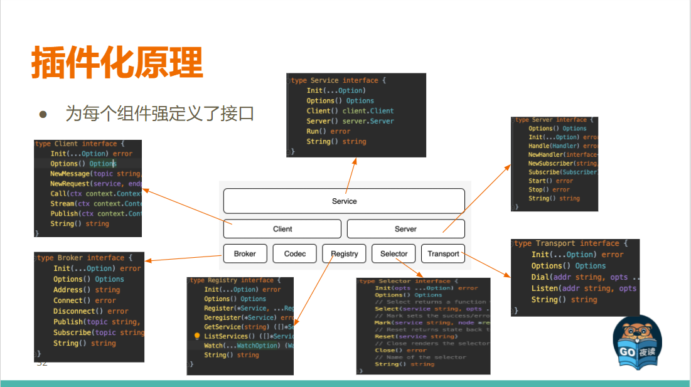

**框架与工具集：Go-Micro（框架）、Micro（运行时工具集）** 

Go Micro 是微服务开发的框架

- 抽象远离分布式系统
- 服务发现, 远程过程调用, 发布订阅, 消息编码
- 带超时, 重试和负载平衡的容错
- 通过包装器扩展功能
- 可交换后端技术的可插拔接口

Go micro 由以下接口列表组成:

- auth - 用于身份验证和授权
- broker - 异步消息传递
- client - 用于高级别请求/响应和通知
- config - 用于动态配置的
- codec - 用于消息编码的
- debug - 调式日志, 跟踪, 统计信息
- network - 多云的网络
- registry - 服务发现的注册表
- runtime - 用于运行服务
- selector - 用于负载平衡
- server - 用于处理请求和通知
- store - 用于数据存储
- sync - 用于同步, 锁和选举领导
- transport - 用于同步通信

上述所有接口可通过插件的方式进行替换。支持的插件在`plugins`目录

